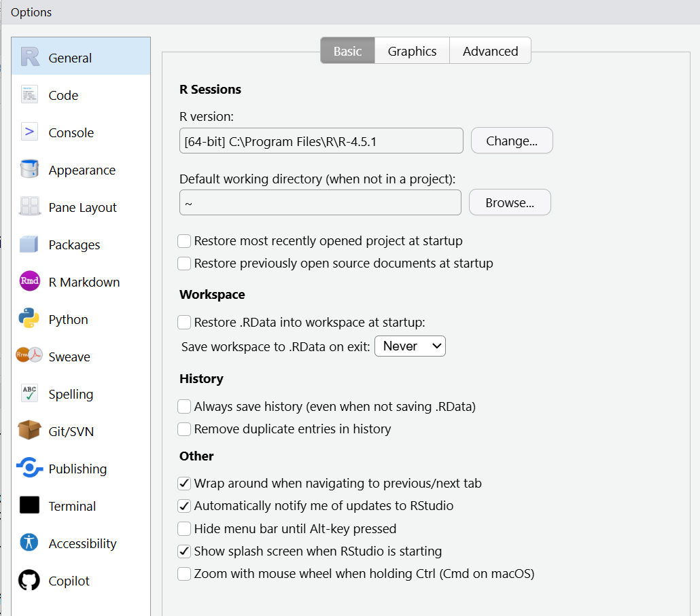
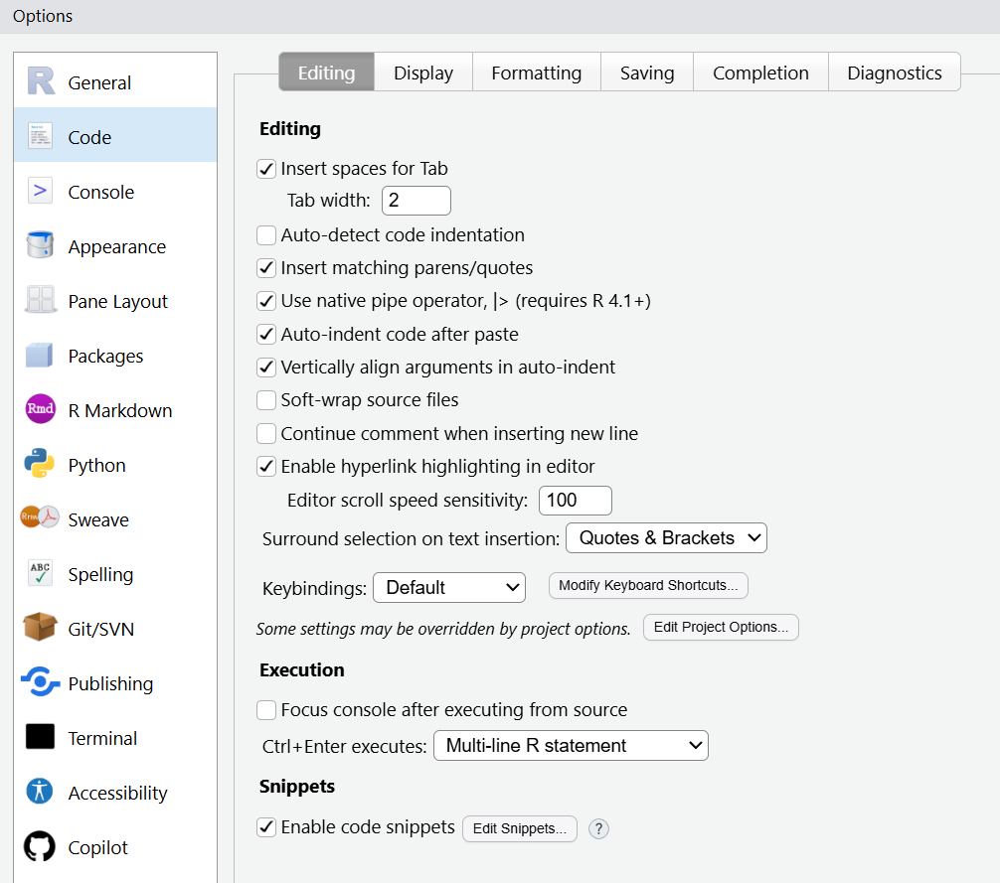
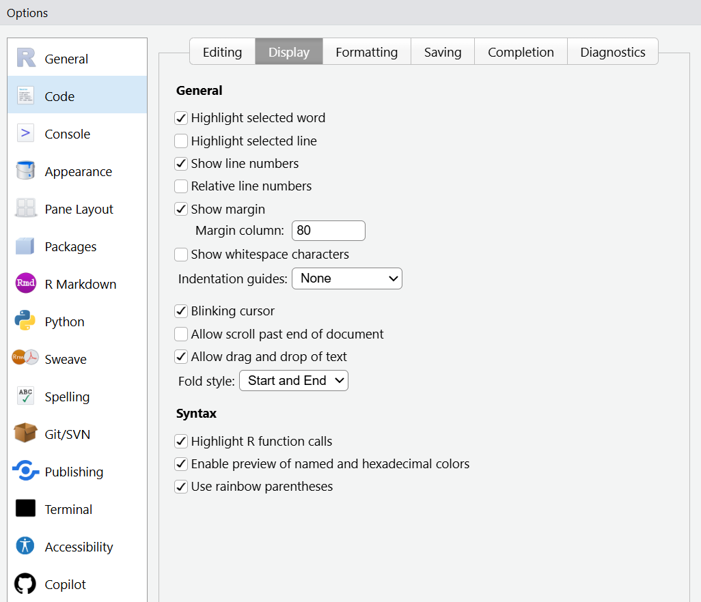
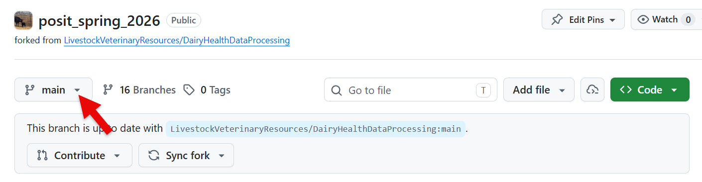
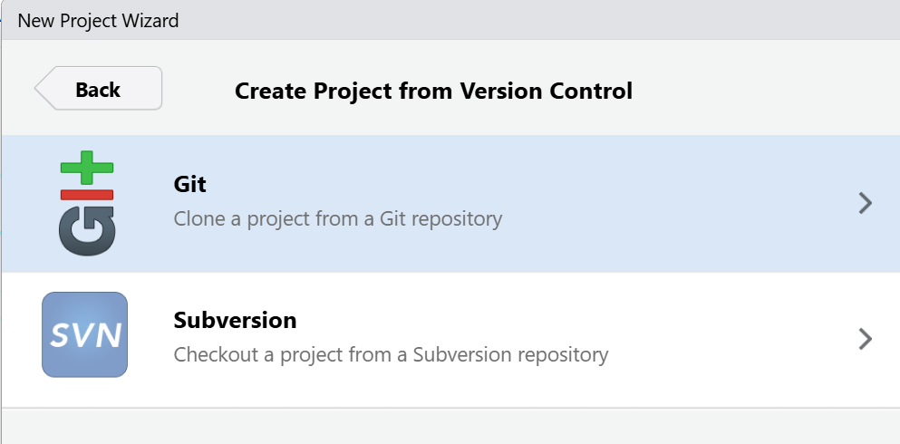
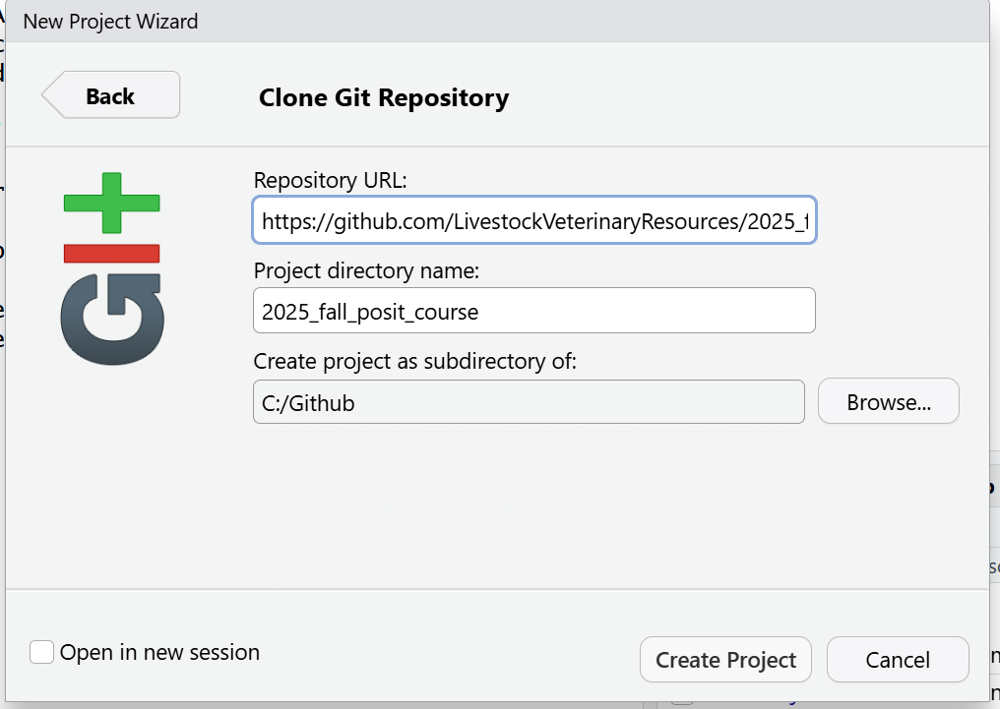

# Supported by

| {width="150"} {fig-align="left"
  width="150"} {width="150"}

# Check Access to Posit Academy Campsite

-   [Posit Course Campsite](https://pub.academy.posit.team/tidyverse/)

This website will have the weekly activities for the course. For the
milestones we will use a repository on GitHub that is dairy specific.
The POSIT site has their own milestone materials but we **encourage**
you to use our example data or even better your own (research or
production)

You will be able to start the Posit materials the week o May 11th. You
will have 2 weeks to complete the first week and we won't discuss
materials in the first week until May 18th. After that you will have 1
week to work on materials. There are 6 week of materials. We will do 1
per week after the first 2 week and than take 2 weeks to do the last
milestone.

If you can't access the site, make sure you have a
[**Posit.cloud**](https://posit.cloud/)account set up with the email you
used to communicate with us.

# Install R and R Studio

*Note: In the POSIT website you will see you can also use Positron.
Positron is newer and has benefits but for teaching this course we will
stick to R Studio as it has less of a learning curve. Feel free to use
Positron but Nora, Pat and Gerard are still learning it too so can offer
less support.*

Links for Windows computers

1.  Download
    [R](https://cran.rstudio.com/bin/windows/base/R-4.5.1-win.exe) and
    [R
    Tools](https://cran.rstudio.com/bin/windows/Rtools/rtools45/files/rtools45-6608-6492.exe)

2.  Download [R
    Studio](https://download1.rstudio.org/electron/windows/RStudio-2025.09.1-401.exe)

3.  Change R Studio settings by going into Tools and Global options to
    reflect the images below

    1.  This allows start up without remembering history

{width="464"}

2.  This sets up to use the new pipe

{width="472"}

3.  This sets up rainbow parenthesis

{width="479"}

# Setting up Github

We will use Github to access and share materials in the course. GitHub
is a version control method that allows you to not have to rename files
to keep track of changes. It requires a few steps to set up but is worth
the effort as it will allow you to go back in time and undo mistakes.

## Set up a personal GitHub Account

-   [GitHub.com](https://github.com)

## Install Git for Windows

Required to make GitHub work. MACs typically have it installed

-   <https://github.com/git-for-windows/git/releases/tag/v2.49.0.windows.1>

## Install Github Desktop

Useful to have to solve certain problems

-   <https://github.com/apps/desktop>

## Further Resources

Outlines the process in more details

-   <https://rfortherestofus.com/2021/02/how-to-use-git-github-with-r>

    or

-   <https://happygitwithr.com/>

# Set up Git and GitHub in R Studio

1.  Open R Studio and install and load packages to set up git

    *Hover in top right corner of the code box below and you can copy
    the code without needing to highlight it.*

```{r}

if (!require("usethis")) install.packages("usethis")
library(usethis)
```

2.  Tell Git who you are

    -   enter your user.name and user.email information that you used to
        set up your GitHub account above

```{r}
use_git_config(user.name = "enter_your_user_name",
               user.email = "enter_your_email.com")
```

3.  Get PAT (Personal Access Token)

    -   Go to the bottom of the screen that show up and press generate

    -   Then copy the PAT

```{r}
usethis::create_github_token()
```

4.  register git using the PAT from Above

```{r}
gitcreds::gitcreds_set()
```

***Below is needed to access the specific milestones we created. Try
this on your own but we have allocated the first week to do this
together. If you get stuck come to the first meeting on Monday May 11th
or Thursday May 14th or we can set up a time to do during that week.***

# Clone the GIT repository for this course to your computer

1.  Go to
    [repo](https://github.com/LivestockVeterinaryResources/posit_spring_2026.git)
    and find the branch with your name

    1.  The branch can be found by clicking on the down arrow beside the
        main word

        

2.  Select code and copy the HTTPS

    {width="383"}

3.  Open R Studio and select new project from File Menu

4.  Select Version Control

{width="399"}

1.  Select Git

    {width="403"}

2.  Enter the url and click create project

    1.  Usually it will work best if you put the folder with your git
        repos in a non cloud based folder on our computer.

        1.  I have use C:\\GitHub as my top level folder.

{width="471"}
